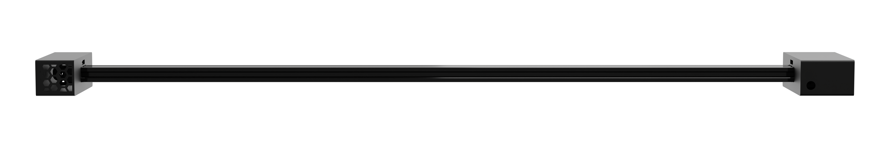
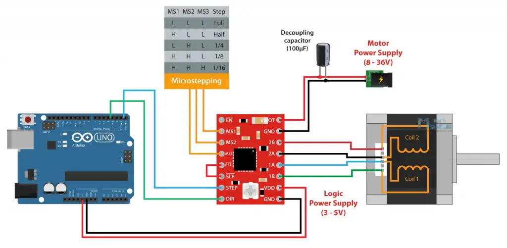

# Openslide

OpenSlide is an Open-Source Camera Slider build with cost effective and well available components.



# How to build your own OpenSlide

## Item list

- [Rails]()  
    We use standardized V-slot aluminum extrusions as rails. These are easy to process and
    easy to obtain.
- [Motor](https://a.aliexpress.com/_mMwP7J2)  
    In order for the cart to automatically travel on the rails, it needs a motor. We have opted for the Nema 17 42 Stepper Motor.
- [Cog belt](https://a.aliexpress.com/_mKwwtJ2)  
    The V-belt is looped around the camera slider; it is responsible for enabling the cart to move along the rails with the help of the motor. Since we couldn't use a standard size, we opted for a set. This allows us to adjust the V-belt ourselves, adapting it to our specific size. This not only ensures a secure fit in terms of size but also allows us to experiment and optimize, as we can adjust the tensile strength ourselves.
- [Cart](https://a.aliexpress.com/_mOrK72g)  
    The cart is pulled back and forth on the rails by the V-belt, making it the moving element in our construction. Ultimately, the camera is attached to the cart, allowing it to move back and forth as desired. The cart has a standard size that corresponds to the rails. Additionally, it is adjustable depending on the type of rails chosen. This ensures that it works for our project.
- [Arduino]()  
    To implement the logic on the camera slider, we use an Arduino Micro-Controller. This has the advantage of being very small while providing all the necessary connections.
- [Power supply](https://a.aliexpress.com/_mNNVPCc)  
    To drive the motor, we require more power than what we can supply through the USB interface. Therefore, we need an external power supply to ensure the proper functioning of the motor.
- [End switch]()  
    To determine the position of the cart on the slider in the code, we need to perform calibration at the beginning. For this purpose, we require two switches, each attached at the start and end of the slider. These switches will notify us when there is contact with the cart.
- [Motor Driver](https://a.aliexpress.com/_m0FvBMk)  
    It is used for communication with the motor, issuing commands such as speed, current consumption, precision, and temperature to the motor.
- [Capacitor]()  
    Capacitors store electrical charges and the associated electrical energy temporarily. This ensures that a constant amount of current reaches the end device, thereby eliminating fluctuations in voltage.
- [Accessories]()  
    To attach various components, we need various screws and hot glue, among other things. We already had these utensils on hand.

## 3D Printing
Print the parts form the `cat/renders/` Folder of the GitHub Project

## Build
### Connect Arduino with Motor 
You can use the following Plan to connect the Motor with the Arduino and the driver.


If you don't want to make changes to the arduino script, use following Ports:

```text
stepPin 5
dirPin 4
```

### Connect Switches
Connect the Switches to the Arduino, use following ports if you don't want to make changes to the script.

```text
#define btnOne 14
#define btnTwo 13
```

### Put everything together

Assemble the Rest of the parts using the Image of the Slider.


## User Interface

You can use our user Interface deployed on [openslide.vercel.app](openslide.vercel.app) or deploy it yourself using the node Application in `/src` directory.


Start using the Slider. Enjoy the Experiance.
